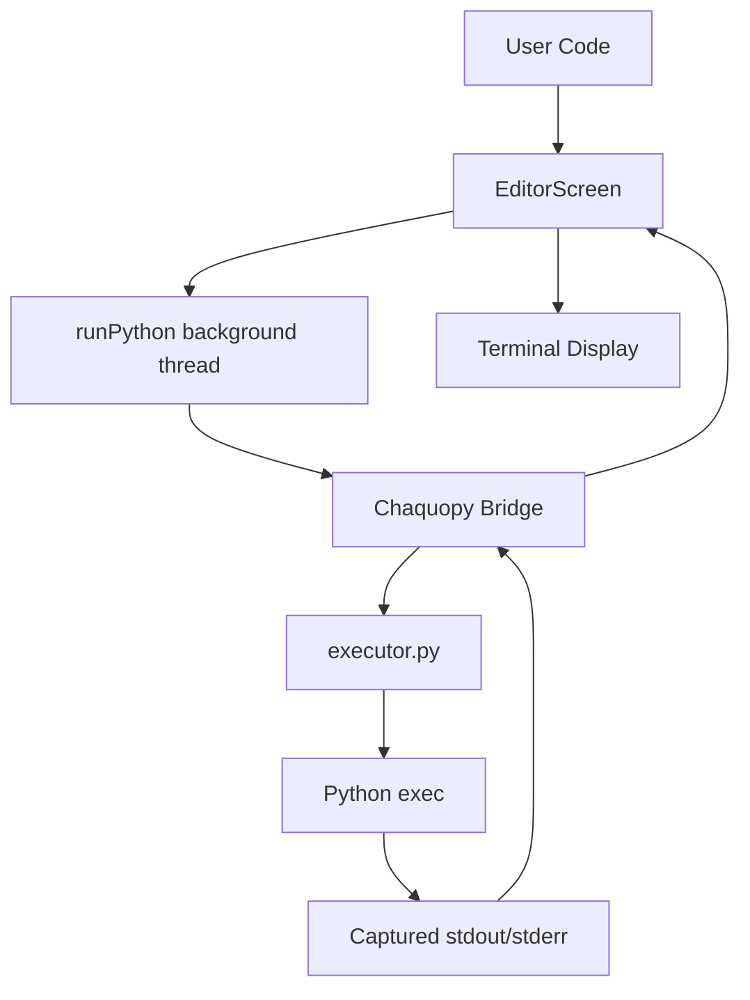

# Execora Architecture

This document describes the high-level architecture of the Execora Python IDE.

## Overview

Execora is built using a bridge between the **Android Native layer (Kotlin/Compose)** and the **Python Interpreter (CPython)** using **Chaquopy**.

## System Components

### 1. UI Layer (Jetpack Compose)
The UI is built entirely with Jetpack Compose, following a Material 3 design system.
- **MainActivity**: The entry point that manages navigation between `Editor`, `Settings`, and `About` screens.
- **EditorScreen**: The primary interface featuring:
    - **Multi-file Tab System**: Manages an in-memory list of `PyFile` objects.
    - **Code Editor**: An `OutlinedTextField` utilizing a custom `VisualTransformation`.
    - **Terminal View**: Displays real-time output from script execution.

### 2. Logic & Persistence
- **SettingsRepository**: Orchestrates app settings using **Jetpack DataStore**. It provides a reactive `Flow` for the app theme (Light/Dark).
- **PythonSyntaxHighlighter**: A custom `VisualTransformation` implementation. It uses regular expressions to identify Python tokens (keywords, comments, strings) and applies `SpanStyle` for real-time highlighting without modifying the underlying text.

### 3. Execution Engine (Chaquopy + Python)
The execution flow works as follows:
1. **Trigger**: User clicks "Run" in the `EditorScreen`.
2. **Bridge**: A background thread is spawned (to prevent UI blocking). It calls `Python.getInstance().getModule("executor").callAttr("run_code", code)`.
3. **Execution**: The `executor.py` script:
    - Redirects `stdout` and `stderr` using `contextlib.redirect_stdout`.
    - Compiles and executes the string using `exec()`.
    - Captures all output and returns it as a string back to Kotlin.
4. **UI Update**: The result is pushed back to the Compose state, triggering a re-composition of the Terminal view.

## Data Flow Diagram

## Theming
Execora uses a custom theme implementation in `ui/theme/Theme.kt` that extends Material 3 with `extraColors` to handle specific IDE requirements like terminal background colors and syntax highlighting colors.
